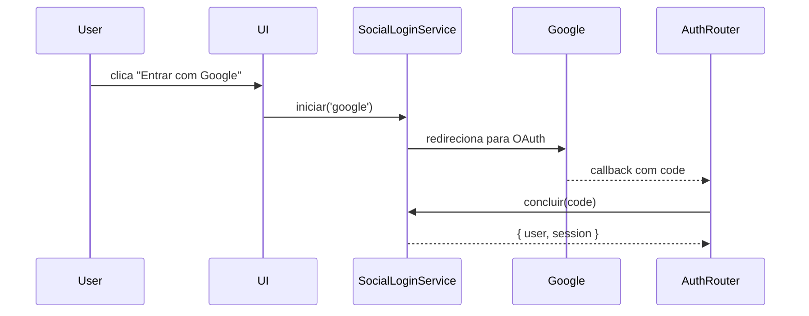

# Code Explanation

**Goal:** Explain code didactically — describe behavior, relationships, and intent — without reproducing the code. The source file is the ground truth; documentation is the map that helps the reader navigate it.

---

## The Prime Rule

> **Link to the file. Don't paste it.**

If the reader wants the exact code, they open the file. Your job is to help them know **why** they'd open it and **what to expect** when they do.

Exceptions (see later): small signature snippets, config values, essence-of-the-fix lines.

---

## How to Describe Code Behaviorally

### Layer 1: Purpose (always)

One sentence. What does this module/function/component **do** at a high level?

> O `SocialLoginService` troca um código de autorização OAuth por um token de acesso e retorna o usuário autenticado.

### Layer 2: Inputs and outputs (when non-trivial)

One line each.

> **Entrada:** `provider: string`, `authCode: string`
> **Saída:** `{ user: User, session: Session }`

### Layer 3: Key steps (when flow isn't obvious from purpose)

Numbered list, each step is behavioral — not line-by-line.

> 1. Valida o `provider` contra a lista de provedores suportados
> 2. Chama a API do provedor trocando `authCode` pelo token
> 3. Busca ou cria o usuário local a partir do perfil do provedor
> 4. Gera e persiste a sessão

### Layer 4: Relationships (when it matters)

Who calls this, who this calls.

> Consumido por [`AuthRouter.tsx`](../../src/auth/AuthRouter.tsx) no handler de callback.
> Depende de [`ProviderAPI`](../../src/integrations/oauth/ProviderAPI.ts) e de [`UserRepository`](../../src/repositories/UserRepository.ts).

---

## When to Paste Code

Paste code **only** when:

1. **The snippet is ≤5 lines** AND central to the explanation
2. **A signature** that the reader must see verbatim (type, function shape)
3. **A config value** or env var format
4. **The "essence of the fix"** line in a bug doc
5. **A schema / type definition** that the doc refers back to

Always language-tag the block:

````markdown
```ts
type Session = {
  userId: string
  expiresAt: Date
  provider: 'google' | 'github' | 'apple'
}
```
````

---

## When NOT to Paste Code

**Never paste:**

- An entire file (link it instead)
- A handler or service method longer than 10 lines
- Boilerplate (imports, class declarations, decorators)
- Generated code (Prisma schemas, GraphQL types, OpenAPI)
- Test files (describe what they cover, don't paste)
- Stack traces (describe the error type, cause, and affected line)

**If you're tempted to paste a long block, ask:** "Could a link + a behavioral description achieve the same?" The answer is almost always yes.

---

## How to Link Code

**Full path (preferred), relative from the doc folder:**

```markdown
[src/auth/SocialLoginService.ts](../../src/auth/SocialLoginService.ts)
```

**With a line range** when pointing at a specific concept:

```markdown
Ver a validação de provider em [SocialLoginService.ts:42-51](../../src/auth/SocialLoginService.ts#L42-L51).
```

**Inline mentions:** Backticks for file names and identifiers:

> A função `validateProvider` em `SocialLoginService.ts` rejeita provedores fora da allowlist.

---

## Explaining Flows

For flows spanning multiple files, use a sequence — either numbered or mermaid.

**Numbered flow (preferred for simple 3-5 step flows):**

```markdown
1. O usuário clica em "Entrar com Google" em [`LoginPage.tsx`](...)
2. O handler chama `SocialLoginService.iniciar('google')`
3. `SocialLoginService` redireciona para a URL OAuth do Google
4. O Google volta para `/auth/callback?code=...`
5. `AuthRouter` captura o callback e chama `SocialLoginService.concluir(code)`
```

**Mermaid sequence** (for flows with 4+ actors or async behavior):

````markdown

````

Limit yourself to **one diagram per doc** unless the task genuinely has multiple independent flows.

---

## Explaining Types and Data Models

**Short type (paste inline):**

```ts
type LoginResult = {
  user: User
  session: Session
  isNewUser: boolean
}
```

**Long type or schema (link, then describe):**

> O modelo completo está em [`prisma/schema.prisma`](../../prisma/schema.prisma). Resumo: `User` tem relação 1:N com `Session`, e cada sessão carrega o provider que a originou.

---

## Explaining Algorithms / Complex Logic

When the "why" is intricate:

1. **Name the problem** being solved
2. **Give the high-level approach** (one or two sentences)
3. **Optional:** numbered pseudo-steps
4. **Link to the real code** with line range

**Example:**

> **Problema:** Ao fazer login social, o `userId` demora 1 tick para atualizar no store, e o `useEffect` dependente dispara antes com o valor antigo.
>
> **Abordagem:** Adicionamos um flag `isAuthSettling` que fica `true` durante a transição e impede que o effect dispare.
>
> Código: [`CartStore.ts:34-58`](...)

---

## Explaining Tests

Don't paste tests. Describe what they cover:

> O arquivo [`cart-store.test.ts`](...) cobre três cenários:
>
> - Carrinho carregado como guest, login preserva itens
> - Login durante transição não dispara fetch duplicado
> - Logout limpa o store

---

## Explaining Configs

**Env vars:** use a table (see template examples).

**Config files:** describe the key, the value range, and the effect.

> Em `next.config.js`, `experimental.serverActions = true` habilita Server Actions no App Router. Sem isso, o endpoint `/auth/callback` não funciona como Server Action.

---

## Anti-Patterns

### ❌ Copying the whole function

```ts
// 40 lines of code pasted here
```

> Fix: link + describe behavior.

### ❌ Narrating line-by-line

> "A linha 3 declara uma variável. A linha 4 chama a função. A linha 5 retorna o resultado."

> Fix: describe the function's purpose, not its lines.

### ❌ Pasting diffs

```diff
- const x = 1
+ const x = 2
```

> Fix: "O valor default mudou de 1 para 2 (arquivo `config.ts`)". The diff is in git.

### ❌ Over-explaining obvious code

> "O componente `Button` é um React component que renderiza um botão."

> Fix: the code already says this. Delete the sentence.

---

## Tips

- **Links > paste, always** — even for short snippets, if a link suffices, prefer the link
- **Behavior > lines** — describe what it does, not how many lines it takes
- **Signatures help** — sometimes just showing the type tells the whole story
- **One diagram max** — resist the urge to add "a diagram for every section"
- **If you must paste, language-tag** — unstyled code blocks are a smell
- **Test behavior in prose beats pasted tests** — describe the guarantees, not the mocks
