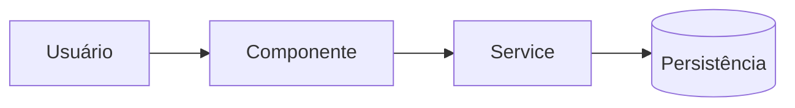

# Template: Feature Documentation

**When to use:** Standard scope, new capability added. Clear "before → after" where the "after" includes something new.

**Target length:** 400-900 words (roughly 2-4 screens).

**All content in pt-BR.**

---

## Template — Copy This Structure

````markdown
# [Nome descritivo da feature]

> **Resumo:** [Uma frase explicando o que essa feature faz e qual problema resolve.]

**Tipo:** Nova feature
**Data da implementação:** [YYYY-MM-DD]
**Arquivos de planejamento:** [se houver, link; senão "Nenhum"]

---

## Objetivo

[Parágrafo curto: qual é o propósito da feature? Quem se beneficia? Que comportamento o sistema passou a oferecer que antes não existia?]

[Se houve motivação específica — um pedido de usuário, uma limitação anterior, um requisito de negócio — mencione em uma linha.]

---

## Arquivos alterados e criados

| Arquivo                                          | Ação       | Papel na feature                                  |
| ------------------------------------------------ | ---------- | ------------------------------------------------- |
| `src/path/to/NovoModulo.ts`                      | Criado     | [Uma linha sobre o que esse arquivo faz]          |
| `src/path/to/ArquivoExistente.tsx`               | Modificado | [O que mudou aqui, resumido]                      |
| `src/types/dominio.ts`                           | Modificado | [Novo tipo adicionado / campo estendido]          |
| `tests/feature.test.ts`                          | Criado     | Testes da feature                                 |

> Arquivos secundários (como testes ou mocks) podem ser agrupados numa linha só para evitar poluição.

---

## Como funciona na prática

[Parágrafo explicando o fluxo em linguagem natural. Imagine que você está contando para um colega: "o usuário faz X, aí o sistema chama Y, que faz Z, e termina em W".]

[Se houver múltiplos fluxos — caminho feliz, caminho de erro, caso especial — descreva cada um brevemente.]

### Fluxo principal

1. [Passo 1 — ex: "O componente `Botao` dispara o handler `aoClicarLogin`."]
2. [Passo 2 — ex: "O handler chama o service `SocialLoginService.iniciar(provider)`."]
3. [Passo 3 — ex: "O service redireciona o usuário para o provedor OAuth."]
4. [Passo 4 — ex: "Após callback, a sessão é persistida no `AuthStore`."]

### Casos especiais

- **[Situação X]:** [O que acontece e onde no código isso é tratado]
- **[Situação Y]:** [O que acontece e onde no código isso é tratado]

---

## Componentes principais

### `NomeDoModulo` — [caminho/do/arquivo]

[Parágrafo curto sobre o papel desse módulo: o que ele expõe, quem o consome, do que depende.]

**Pontos importantes:**

- [Método ou responsabilidade principal]
- [Dependência crítica — serviço externo, biblioteca]

### `OutroModulo` — [caminho/do/arquivo]

[Mesmo formato]

> Componentes pequenos de apoio (helpers, tipos, formatters) podem ficar numa lista resumida no final desta seção.

---

## Decisões técnicas

> Documente apenas decisões que estão realmente refletidas no código ou no planejamento. Se não houver uma decisão digna de nota, remova esta seção inteira.

### [Decisão 1 — ex: "Uso da biblioteca `next-auth` para OAuth"]

**O que:** [O que foi decidido]
**Por quê:** [Motivo registrado no planejamento ou inferível claramente do código]
**Consequência:** [O que isso implica no resto do sistema]

### [Decisão 2]

[Mesmo formato]

---

## Diagrama (opcional)

> Inclua somente se esclarecer o fluxo. Remova esta seção se não agregar.



---

## Como testar / verificar

[Instruções curtas para validar que a feature funciona: comando, passo no UI, rota da API. Sem reinventar — só o que realmente existe.]

```bash
# exemplo
npm run test -- feature.test.ts
```

Ou:

- Abra [rota / tela]
- Clique em [botão / ação]
- Espere [resultado observável]

---

## Notas finais

[Parágrafo opcional com: pontos de atenção, dependências externas que precisam estar configuradas, variáveis de ambiente novas. Breve.]

[Se houver variáveis de ambiente novas, liste-as:]

| Variável          | Uso                                   | Obrigatória |
| ----------------- | ------------------------------------- | ----------- |
| `OAUTH_CLIENT_ID` | Credencial do provedor OAuth          | Sim         |
| `OAUTH_SECRET`    | Segredo do provedor OAuth             | Sim         |
````

---

## What to Cut if the Task is Smaller

If the feature is borderline Quick/Standard, omit:

- "Diagrama" section
- "Componentes principais" (merge into "Como funciona na prática")
- "Decisões técnicas" (only if no real decisions to document)

Keep:

- Objetivo
- Arquivos alterados
- Como funciona na prática
- Como testar / verificar

---

## What to Expand if the Task is Bigger

For larger features, add:

- **Integrações externas** — APIs, webhooks, serviços chamados
- **Modelos de dados** — se novos tipos/tabelas foram criados
- **Tratamento de erros** — se há lógica de fallback relevante

But if those expansions push you into Multi-phase territory, switch to [template-multi-phase.md](template-multi-phase.md) instead.

---

## Tips

- **A primeira frase é a documentação em miniatura** — gaste tempo nela
- **"Como funciona na prática" é a seção mais valiosa** — priorize sua clareza
- **Não liste testes linha a linha** — "Adicionados testes em `tests/feature.test.ts` cobrindo fluxo principal e 2 casos de erro" basta
- **Decisões técnicas podem ser omitidas** — só inclua se houver decisão real documentada
- **Tabelas > parágrafos** para listar arquivos
- **Links > código colado** — sempre
