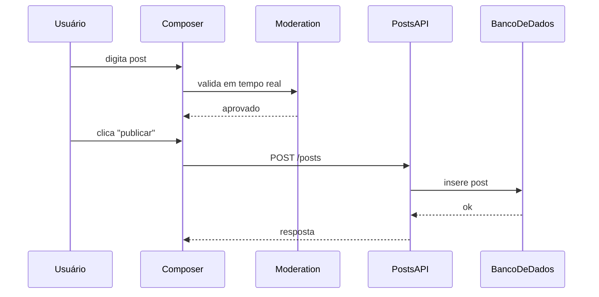

# Template: Multi-Phase Documentation

**When to use:** Task was split across multiple planning files or phases. The final system is the sum of all phases, not just the last.

**Target length:** 800-2000 words. Larger because it must cover the whole arc.

**All content in pt-BR.**

**Prerequisite:** [analyze-phases.md](analyze-phases.md) completed. You have an ordered list of phases with their implementation mapping.

---

## Template — Copy This Structure

````markdown
# [Nome do projeto / feature completa]

> **Resumo:** [Uma frase cobrindo o que o sistema passou a fazer ao final de todas as fases. Não descreva o processo — descreva o resultado.]

**Tipo:** Implementação em fases
**Período:** [data de início] → [data de término]
**Arquivos de planejamento:**

- [`.planning/01-...`](../.planning/01-...)
- [`.planning/02-...`](../.planning/02-...)
- ... (listar todos em ordem)

---

## Visão geral

[Parágrafo amplo explicando: qual era o objetivo geral, por que foi dividido em fases, como as fases se encaixam. Foco em entendimento rápido — a pessoa lendo em 6 meses deve pegar o essencial em 1 minuto.]

[Se houver um "grande porquê" — motivação de negócio, requisito externo — coloque aqui, em uma linha.]

---

## Linha do tempo (visão macro)


**Resumo por fase:**

| Fase | Planning                       | Entrega principal                          | Data       |
| ---- | ------------------------------ | ------------------------------------------ | ---------- |
| 1    | `.planning/01-data-model.md`   | Entidades `User`, `Post`, `Auth`           | YYYY-MM-DD |
| 2    | `.planning/02-api-endpoints.md`| CRUD HTTP de posts                         | YYYY-MM-DD |
| 3    | `.planning/03-moderation.md`   | Serviço de moderação + validações          | YYYY-MM-DD |
| 4    | `.planning/04-ui.md`           | Tela de listagem e composer                | YYYY-MM-DD |
| 5    | `.planning/05-integration.md`  | Composer integrado com moderação em tempo real | YYYY-MM-DD |

---

## Por fase

### Fase 1 — [Título descritivo]

**Planning:** [link]
**Entrega:** [O que ficou pronto no final dessa fase, em 1-2 frases]

**Arquivos principais:**

- `src/entities/User.ts` — [o que define]
- `prisma/schema.prisma` — [o que adicionou]

**Decisões desta fase:**

- [Decisão real com 1 frase de contexto]

**Depende de:** [nada / fases anteriores]

---

### Fase 2 — [Título descritivo]

**Planning:** [link]
**Entrega:** [...]

**Arquivos principais:**

- `src/api/routes/posts.ts`
- `src/api/controllers/PostController.ts`

**Decisões desta fase:**

- [Decisão]

**Depende de:** Fase 1 (entidades)

---

### Fase 3 — [Título descritivo]

[Mesmo formato]

---

### Fase 4 — [Título descritivo]

[Mesmo formato]

---

### Fase 5 — [Título descritivo]

[Mesmo formato — costuma ser a fase de "amarra tudo"]

---

## Decisões transversais

> Decisões que atravessam múltiplas fases. Essas são as mais valiosas para o leitor — elas explicam a forma do sistema.

### [Decisão 1 — ex: "Escolha do Zustand para estado global"]

- **Tomada em:** Fase 2
- **Aplicada em:** Fases 2-5
- **Por quê:** [Motivo real registrado]
- **Impacto:** [Como isso moldou o resto do código]

### [Decisão 2 — ex: "Renomeação de `User` para `Account`"]

- **Tomada em:** Fase 3 (mid-implementation)
- **Aplicada em:** Todo o código após Fase 3
- **Por quê:** [...]
- **Impacto:** [Se há imports legados, breaking changes internos, etc.]

---

## Divergências entre plano e código

> Inclua somente se houver divergências reais. Se o código implementou exatamente o que estava planejado, remova esta seção.

- **[Item 1]:** Plano previa X, implementação entregou Y. Motivo documentado / inferido: [...].
- **[Item 2]:** Feature Z foi adiada para fase futura. Referência: [link].

---

## Arquitetura final

[Parágrafo amplo descrevendo a forma atual do sistema depois de todas as fases. O leitor deve conseguir, só com esta seção, reconstruir a estrutura mental do módulo.]

```
src/
├── entities/          # Fase 1
├── api/
│   ├── routes/        # Fase 2
│   └── controllers/   # Fase 2 (evolui em Fase 3)
├── services/
│   └── moderation/    # Fase 3
└── components/
    └── posts/         # Fase 4 (integrado em Fase 5)
```

**Dependências principais entre módulos:**

- `components/posts/Composer.tsx` usa `services/moderation` e chama `api/routes/posts`
- `services/moderation` lê de `entities/User` para políticas

---

## Fluxo end-to-end (opcional)

> Somente se esclarecer. Para sistemas complexos com múltiplas fases interagindo, um diagrama único costuma ajudar.



---

## Como testar o sistema completo

[Checklist alto-nível cobrindo as fases integradas. Não é um guia de QA — é o mínimo para verificar que o sistema inteiro está funcionando.]

```bash
npm run test
```

- [ ] Entidades migram corretamente (Fase 1)
- [ ] Endpoints respondem (Fase 2)
- [ ] Moderação bloqueia entrada inválida (Fase 3)
- [ ] UI lista posts existentes (Fase 4)
- [ ] Composer publica e aparece na lista sem reload (Fase 5)

---

## Estado atual e próximos passos

[Parágrafo final: o que está pronto, o que ficou fora do escopo dessas fases e pode virar trabalho futuro — somente se estiver registrado em algum planejamento ou TODO. Não especule.]

**Fora do escopo destas fases (documentado):**

- [Item 1 que está em backlog]
- [Item 2 que está em backlog]
````

---

## What to Cut

- "Fluxo end-to-end" se já houver diagrama macro suficiente
- "Divergências" se não houver
- "Decisões transversais" se não houver decisões que cruzem fases

---

## What to Expand

- Se uma fase for especialmente densa, pode ganhar seu próprio sub-arquivo em `assets/fase-3.md` — mas isso é raro, prefira manter tudo no `README.md` principal
- Se o projeto tem integrações externas complexas, adicione "Integrações externas" entre "Arquitetura final" e "Fluxo end-to-end"

---

## Tips

- **Timeline macro é a espinha dorsal** — O diagrama e a tabela de fases são o mapa do doc
- **Por-fase + transversais é a combinação mágica** — Por-fase dá detalhe, transversais explicam o todo
- **Não invente uma fase para preencher a tabela** — Se a Fase 2 foi trivial, documente como trivial
- **Divergências são valiosas** — Plano ≠ realidade é normal; documentar ajuda futuro-você a entender por quê
- **Estado atual > próximos passos** — Foque no que foi feito, não no que poderia ser feito
- **Se o doc passa de 2000 palavras**, considere se uma fase é grande o bastante para virar um doc próprio
